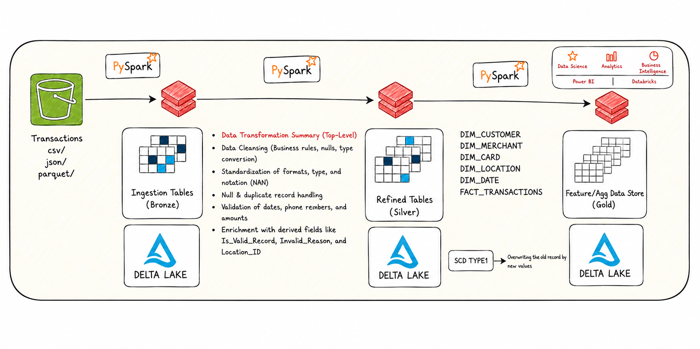
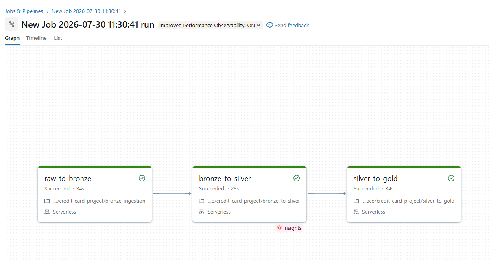
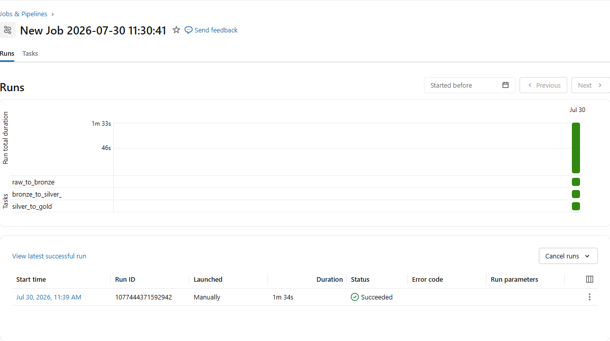

# 🚀 End-to-End Credit Card ETL Pipeline: Databricks & PySpark

## 📌 Project Overview

This project implements a scalable, end-to-end ETL (Extract, Transform, Load) data pipeline built entirely within **Databricks** using **PySpark**. The pipeline processes raw, multi-format credit card transaction data extracted from an **AWS S3** data lake, cleanses and standardizes it, and models it into a **Star Schema** ready for downstream Business Intelligence (BI) and Machine Learning (ML) consumption.

The pipeline follows the **Medallion Architecture** (Bronze, Silver, Gold), leveraging **Delta Lake** to ensure ACID compliance, time-travel capabilities, and optimized query performance. The entire workflow is automated and orchestrated using **Databricks Workflows/Jobs**.

## 🛠️ Tech Stack

* **Cloud Platform:** AWS (S3, IAM)
* **Compute & Processing:** Databricks (Free/Community Edition), PySpark, Python, Spark SQL
* **Storage:** Delta Lake
* **Data Modeling:** Star Schema, SCD Type 1 (Slowly Changing Dimensions)
* **Orchestration:** Databricks Workflows / Jobs

---

## 🏛️ Medallion Architecture Data Flow

### 1. Source (Landing Zone)
Raw transaction data is staged in an **AWS S3 bucket**, arriving in three distinct file formats: **CSV, JSON, and Parquet**.

### 2. 🥉 Bronze Layer (Raw Ingestion)
Brings raw data into Databricks with minimal manipulation, unifying it into a single format:

* **AWS S3 Integration:** Connects Databricks to S3 using IAM Access/Secret Keys.
* **Schema Alignment:** Reads the CSV, JSON, and Parquet files into separate PySpark DataFrames, dynamically reorders columns so schemas match, and `.union()`s them into one comprehensive DataFrame.
* **Optimization:** Derives a `Transaction_Year` column from the transaction dates to dynamically partition and `.repartition()` the data.
* **Storage:** Saves the unified output as a managed Delta table (`transactions_raw`) to optimize backend Parquet file storage.

### 3. 🥈 Silver Layer (Cleansing & Transformation)
Standardizes, validates, and cleans the data:

* **Date Handling:** Converts string dates to `DateType`. Filters invalid records (e.g., date of birth in the future, expired/future card dates).
* **String Standardization:** Trims whitespace, enforces proper/title casing, and uses RegEx (`regexp_replace`) to strip non-alphabetic characters from names and cities.
* **Categorical Normalization:** Uses `when().otherwise()` expressions to standardize anomalies (e.g., mapping `M` → `Male`, `F` → `Female`, mapping cities to state/location IDs).
* **Validation via RegEx:** Validates email format (`word@word.com`) and enforces 10-digit phone numbers. Backfills missing customer names by parsing the string before the `@` in their email.
* **Null Imputation:** Maps dirty missing-value representations (e.g., `"na"`, `"unknown"`, `"-"`, `"none"`) to standard SQL `NULL` via a dynamic dictionary replacement function, and drops true duplicate/null records.
* **Audit Columns:** Engineers `is_valid` / `invalid_reason` flags to capture rejected records without losing the audit trail.

### 4. 🥇 Gold Layer (Dimensional Modeling)
Organizes the clean data into a **Star Schema** for BI and ML consumption:

* **Dimension Tables:** `dim_customer`, `dim_merchant`, `dim_card`, `dim_location`, and an auto-generated `dim_date` (spanning years 2000–2035).
* **Fact Table:** `fact_transaction`, containing primary keys, measurable metrics (e.g., transaction amounts), and foreign keys linking back to the dimension tables.
* **Dynamic SCD Type 1:** Rather than hardcoding `MERGE INTO` SQL, a dynamic PySpark function reads the target table's schema and constructs the `UPDATE SET` / `INSERT` clauses programmatically using list comprehensions — decoupling merge logic from schema structure and reducing maintenance overhead.

---

## ⚙️ Pipeline Orchestration

The pipeline is automated using **Databricks Jobs**, with tasks chained sequentially so each stage triggers only after the previous one succeeds:

1. `00_Catalog_Creation` — sets up `bronze`, `silver`, and `gold` schemas
2. `01_Bronze_Ingestion`
3. `02_Silver_Transformations`
4. `03_Gold_Modeling`

Databricks natively handles the task dependencies, so Silver only runs after Bronze succeeds, and so on.

### Successful Job Execution

---

## 🚀 Setup & Execution Instructions

### 1. AWS Setup
* Create an S3 bucket and upload the raw CSV, JSON, and Parquet files into separate folders.
* Generate AWS Access Keys from the IAM Security Credentials console.

### 2. Databricks Setup
* Create a free/community edition Databricks account.
* Import the notebooks into your Databricks Workspace.
* Update the S3 URIs and Access Keys within the `Bronze` notebook.

### 3. Run the Pipeline
* Run the `00_Catalog_Creation` notebook to set up your schemas (`bronze`, `silver`, `gold`).
* Navigate to the **Workflows / Jobs** tab, create a new job, add the notebooks as sequential tasks, and click **Run Now** to trigger the end-to-end pipeline.

---

## 📈 Business Impact

This pipeline transforms fragmented, inconsistent raw transaction data into a reliable Single Source of Truth (SSOT). Dynamic schema handling and SCD-1 merge logic reduce ongoing code maintenance, while Delta Lake's partitioning ensures BI dashboards can query efficiently against curated, analysis-ready tables.